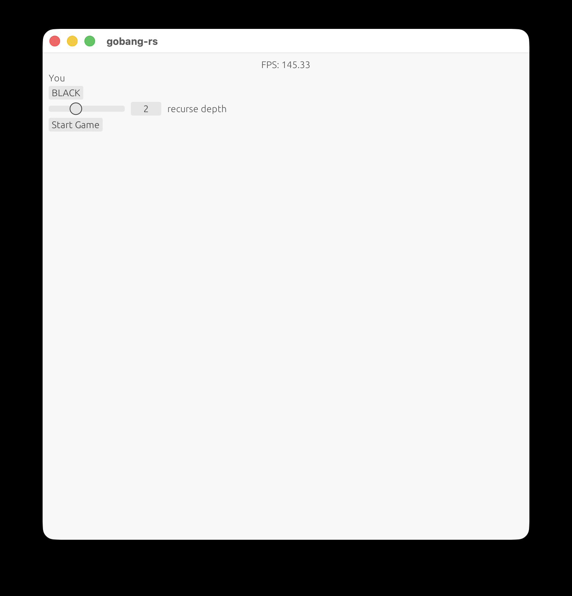
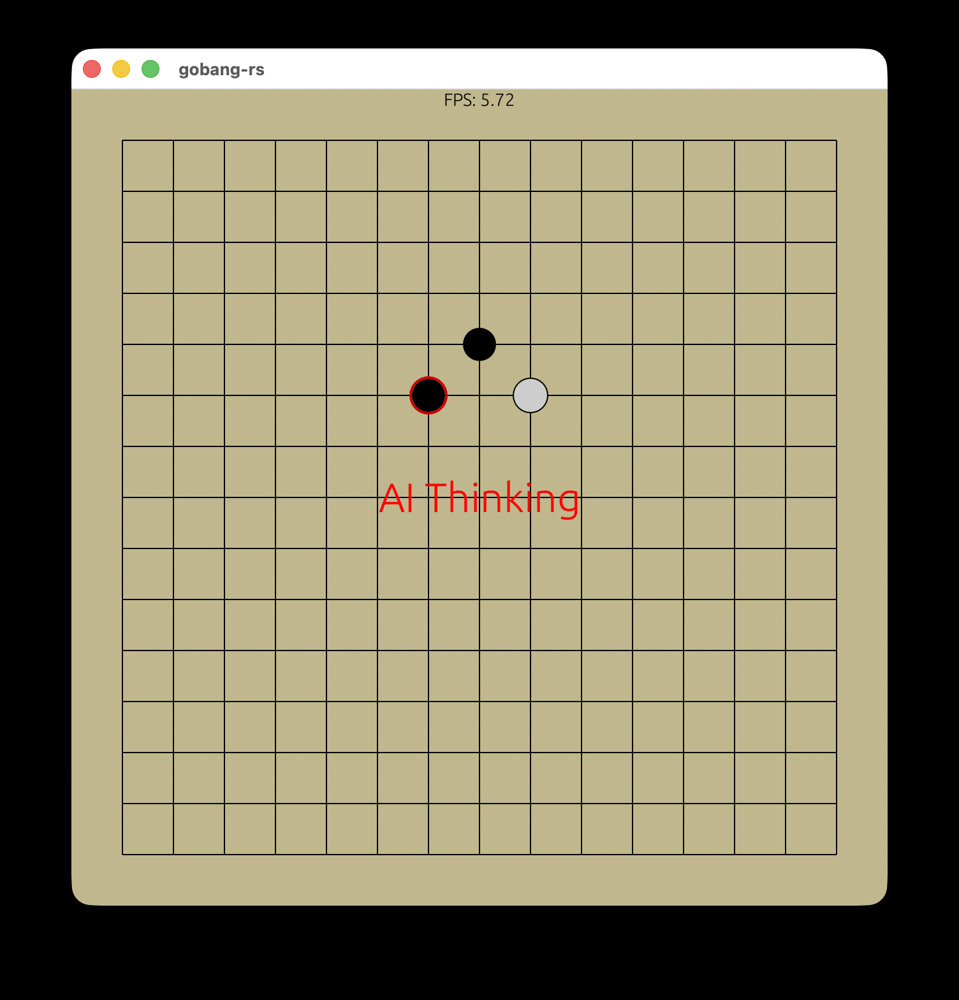
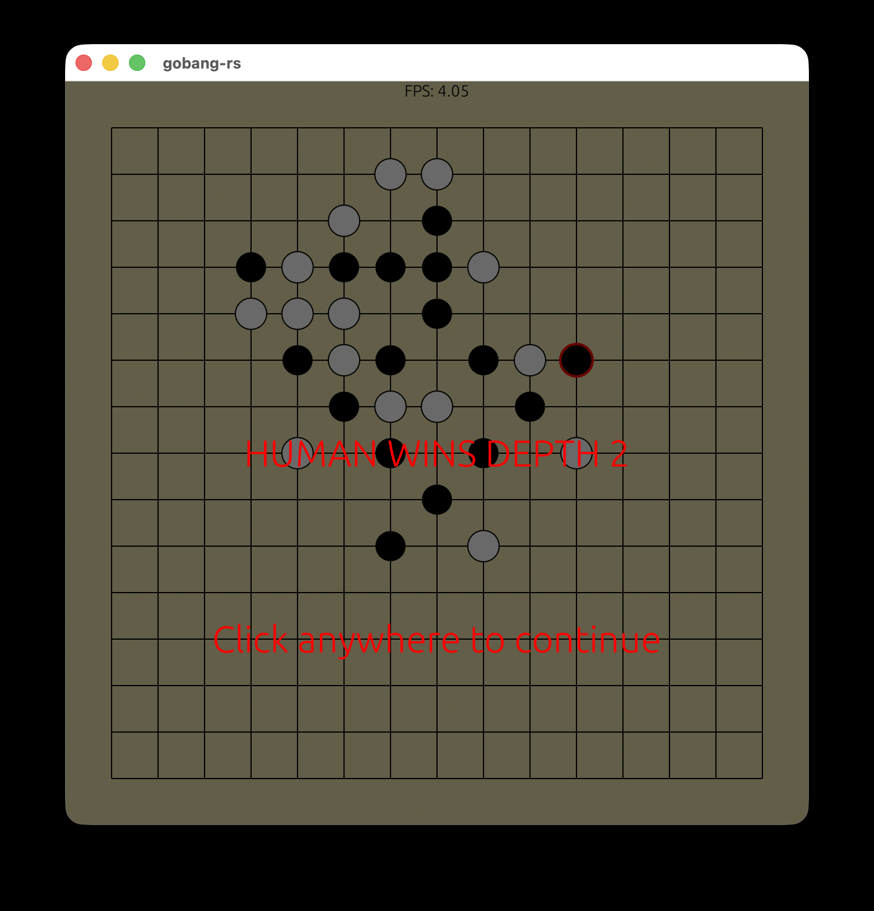
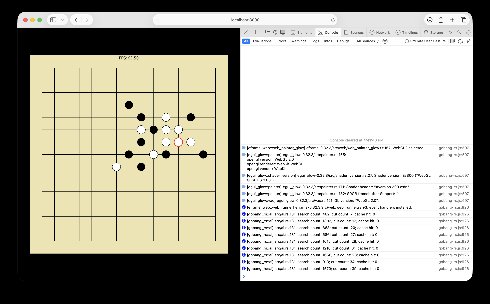

<h1 align="center">gobang-rs</h1>

Yet another gobang game based on egui(rust), supporting multiple platforms, including desktop and web.

Main Algorithms: **game tree**, **negamax**, **alpha-beta pruning**, **zobrist**.

## 📷 Screenshots

**basic configurations**



**gaming**



**settlement**



**on web**



## 🚀 Quick Start

A Rust environment is necessary. [Rustup](https://rust-lang.org/learn/get-started/) is highly recommended.

### Desktop

```shell
cargo run --release --target aarch64-apple-darwin # MacOS
```

### WebAssembly

You can change `python3 -m http.server` to any type of web server according to your preferences.

```shell
cargo build --target wasm32-unknown-unknown --release # rustup target add wasm32-unknown-unknown
wasm-bindgen ./target/wasm32-unknown-unknown/release/gobang-rs.wasm  --out-dir ./web --target web # cargo install wasm-bindgen-cli
python3 -m http.server -d ./web
```
